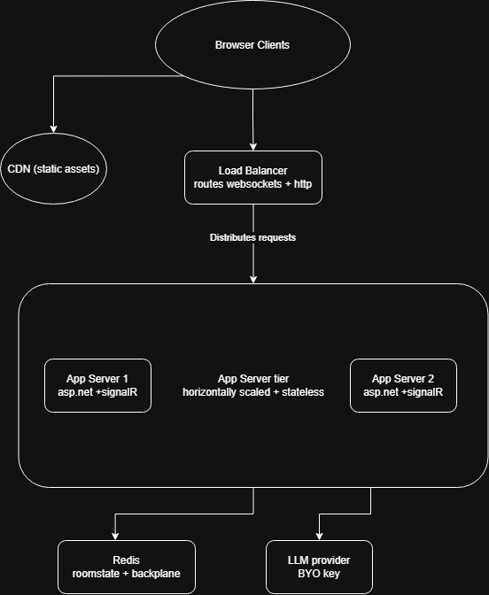

# Syncode

> Real-time collaborative code editing with a built-in AI assistant.

Syncode is a web application where anyone can spin up a shared code editing room via a shareable link, collaborate in real time, and consult an AI assistant scoped to the session.

## System Architecture

